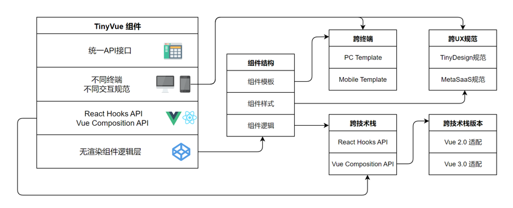

# TinyVue

TinyVue 是一个跨端、跨框架的企业级 UI 组件库，基于 OpenTiny Design 设计体系，支持 Vue 2 和 Vue 3，支持 PC 端和移动端。

🌈 特性：

- 📦 包含 130 多个简洁、易用、功能强大的组件
- 🖖 一套代码同时支持 Vue 2 和 Vue 3
- 🖥️ 一套代码同时支持 PC 端和移动端
- 🌍 支持国际化
- 🎨 支持主题定制
- 📊 组件内部支持配置式开发，可支持低代码平台可视化组件配置
- 💡 采用模板、样式、逻辑分离的跨端、跨框架架构，保障灵活性和可移植性

## 🛠️ 核心亮点

### 1、一套代码同时支持 Vue 2 / Vue 3

随着 Vue 3 的逐渐普及以及 Vue 3 开源生态的持续繁荣，未来将会有更多开发者投入 Vue 3 的怀抱，使用 Vue 3 开发新业务，同时存量的 Vue 2 项目也会逐渐迁移到 Vue 3 中来。

目前业界主流的 Vue 组件库，要么只支持 Vue 3，要么分成 Vue 2 / Vue 3 两套组件库，比如饿了么的ElementUI，它的Element UI for Vue 2，而Element Plus for Vue 3。再比如 Ant Design of Vue，它的 1.x 版本 for Vue 2，而 3.x 版本 for Vue 3。

由于 Vue 2 / Vue 3 两套组件库对应两套不同的代码，难免存在组件功能和 API 不同步的情况，开发者如果要从 Vue 2 组件库迁移到 Vue 3 组件库，将面临一定的成本和风险。

OpenTiny 采用组件与框架分离的设计理念（Renderless 架构），将组件拆分为三个构成部分：组件模板、组件样式和组件逻辑，并针对 Vue 2 和 Vue 3 实现了相应的版本适配器，抹平 Vue 2 和 Vue 3 的差异，实现一套代码同时支持 Vue 2 和 Vue 3。

这样不管是 Vue 2 项目还是 Vue 3 项目，使用组件的方式都是一样的，可以实现无缝切换，极大地降低了 Vue 2 迁移到 Vue 3 的成本和风险。

### 2、一套代码同时支持PC和移动端

得益于 OpenTiny 的 Renderless 架构，我们不仅实现了一套代码同时支持 Vue 2 和 Vue 3，还实现了一套代码支持多端，这意味着：

我们支持 PC 和移动端，同一个组件在不同终端表现不同

在多端场景下组件的使用方式完全相同

### 3、组件丰富，功能强大

历经 9 年时间打磨，服务于公司内外部1500多个业务，稳定、可靠、安全。

PC 端包含 130 多个组件，移动端包含 30 多个组件，Table、Tree、Select 等高频组件均内置虚拟滚动，在大数据场景下保持丝滑体验。

除了业界组件库都有的组件，我们也提供了一些 OpenTiny 独有的特色组件：

- Split 面板分隔器
- IpAddress IP 地址输入框
- CalendarView 日历
- Crop 图片裁切

欢迎大家体验和使用！

## 🤝 面向未来的技术架构

OpenTiny 采用组件和框架分离的设计理念，支持跨端跨技术栈跨版本 Web 组件只有一套 API 接口，Web 组件可拆分为三个构成部分：组件模板、组件样式和组件逻辑。

组件模板借助 Renderless Component 无渲染组件的设计模式，分离出来的模板可以多样化，以适配不同的终端，比如 PC 端模板和 Mobile 端模板。

React 组件的业务逻辑借助 React Hooks API，Vue 组件的业务逻辑借助 Vue Composition API，实现面向业务逻辑编程，这样不同技术栈的相同业务逻辑代码就汇聚到一起。

对于同一个技术栈的不同版本，比如 Vue 2.0 和 Vue 3.0 则可以做一个版本适配器，只要保证组件逻辑函数的输入输出保持统一即可。

技术架构图：

